# Midnight DUST Sponsorship Example

> Attribution: This project is built on the Midnight Network.

A working example of **fee sponsorship** on Midnight: one wallet (the **sponsor**) pays
the DUST transaction fees for another wallet (the **user**) that holds zero DUST. A
contract call from the user's identity lands on-chain, with fees paid by the sponsor.

Crucially, it shows that sponsorship separates **who pays** from **who is authorized**.
The contract authorizes a caller by proving knowledge of a secret
(`assert(publicId(secret) == authority)`). The user proves this and runs the action; the
sponsor pays the fee but **cannot** perform the action, because it does not know the
secret. (This avoids `ownPublicKey()` for authorization; the
[security docs](https://docs.midnight.network/compact/smart-contract-security) warn it is
a prover-controlled witness and must not be trusted as an authenticated caller.)

## How it works

```mermaid
flowchart LR
    subgraph U["User wallet (0 DUST)"]
        direction TB
        U1["createUnprovenCallTx(register / act)"]
        U2["proofProvider.proveTx(...)"]
        U3["balanceUnboundTransaction(['shielded','unshielded'])"]
        U4["signRecipe(user sig)"]
        U5["finalizeRecipe() → FinalizedTransaction"]
        U1 --> U2 --> U3 --> U4 --> U5
    end

    subgraph S["Sponsor wallet (has DUST)"]
        direction TB
        S1["POST /sponsor (tx)"]
        S2["Transaction.deserialize(binding)"]
        S3["balanceFinalizedTransaction(['dust'])"]
        S4["signRecipe(sponsor sig)"]
        S5["finalizeRecipe()"]
        S6["submitTransaction() → txHash"]
        S1 --> S2 --> S3 --> S4 --> S5 --> S6
    end

    U5 -- "hex (FinalizedTransaction)" --> S1
```



The user is always the prover, so the sponsor never sees the user's private state (its
secret). The user **balances its own side, signs, and finalizes (binds) first**, then
hands over a `FinalizedTransaction`. The sponsor can only *add* a DUST fee offer
(`balanceFinalizedTransaction(['dust'])`); it cannot alter the user's bound contents.
This is the order used by the official
[midnight-wallet dust-sponsorship snippet](https://github.com/midnightntwrk/midnight-wallet/blob/main/packages/docs-snippets/src/snippets/dust-sponsorship.ts).

## Prerequisites

- Node.js **≥ 22** (the SDK does not support Node 20). A `.nvmrc` is included: `nvm use`.
- Docker + Docker Compose v2 (for the local devnet).
- A local devnet from
  [`midnightntwrk/midnight-local-dev`](https://github.com/midnightntwrk/midnight-local-dev)
  on the standard ports: node `9944`, indexer `8088`, proof server `6300`, network id
  `undeployed`.

Start the devnet:

```bash
git clone https://github.com/midnightntwrk/midnight-local-dev

# Installation
cd midnight-local-dev
npm install

# Quick Start
npm start
```

## Setup

```bash
nvm use                  # Node 22
npm install
npm run build:contract   # contracts/authorized-action.compact → src/managed/authorized-action
```

## Running

Full flow as a test (fund → deploy → sponsor → user register + act → verify, plus two
negative cases):

```bash
npm run e2e
```

Or step by step, in order:

```bash
npm run fund     # fund the sponsor with NIGHT + DUST; the user is left with zero DUST
npm run deploy   # deploy authorized-action, writing deployed-contract.json
npm run sponsor  # start the sponsor HTTP service on :3001 (leave running)
npm run user     # prove register() then act() as the user; hand each to the sponsor
npm run verify   # assert authority == user identity (not sponsor) and user DUST == 0
```
